# 🔮 Introspection

[![Chickensoft Badge][chickensoft-badge]][chickensoft-website] [![Discord][discord-badge]][discord] ![line coverage][line-coverage] ![branch coverage][branch-coverage]

Create mixins and generate metadata about types at build time to enable reflection in ahead-of-time (AOT) environments.

---

<p align="center">

</p>

## 🥚 Installation

Find the latest version of the [Introspection] and [Introspection Generator] packages from nuget and add them to your C# project.

> [!WARNING]
> Introspection is compiled against the latest .NET 8 SDK. Because .NET 8 encompasses multiple versions of the [.NET compiler], compiling your project against an older version of .NET 8 may generate a `CS9057` warning to indicate a compiler-version mismatch. However, if the warning is ignored, less-tractable downstream compilation errors, or even runtime errors, may result. Therefore, we strongly recommend treating `CS9057` as an error to catch compiler versioning issues at the earliest opportunity.

```xml
<Project Sdk=...>
  <PropertyGroup>
    <TargetFramework>net8.0</TargetFramework>
    ...
    <!-- Catch compiler-mismatch issues -->
    <WarningsAsErrors>CS9057</WarningsAsErrors>
    ...
  </PropertyGroup>

  <ItemGroup>
    <PackageReference Include="Chickensoft.Introspection" Version=... />
    <PackageReference Include="Chickensoft.Introspection.Generator" Version=... PrivateAssets="all" OutputItemType="analyzer" />
  </ItemGroup>
</Project>
```

## 📙 Background

This is a metaprogramming tool that powers some of the other Chickensoft tools. Introspection exists to enable C# developers to get information about a type at runtime without needing reflection that wouldn't work or be guaranteed to work in all scenarios when compiling for ahead-of-time targets like iOS.

The introspection package provides the following features:

- ✅ Create a registry of all types visible from the global scope.
- ✅ Generate metadata about visible types.
- ✅ Track types by id and version.
- ✅ Allow types to implement and look up mixins.
- ✅ Compute and cache type hierarchies, attributes, and properties.
- ✅ Track generic types of properties in a way that enables convenient serialization in AOT environments.

You don't need to fully understand this package to make the most of it. In fact, you may never need to use it directly since you are more likely to encounter it as a dependency of one of the other Chickensoft tools:

- 💾 [Serialization] uses this tool to gather information about types at build-time to perform serialization and deserialization at runtime without having to resort to unsupported reflection techniques in AOT environments.
- 💉 [AutoInject] uses this tool to allow you to add mixins to classes at build-time and invoke their methods at runtime without reflection. It also leverages this to read attributes on types without having to use reflection.
- 💡 [LogicBlocks] uses this tool to look up possible states for a state machine so it can pre-allocate them at runtime without needing reflection.

> [!NOTE]
> In general, you will typically just include this project and its source generator in your project so that other tools can make use of the generated metadata about the types in your project. For those interested in building metaprogramming tools which leverage this package, read on!

The introspection generator is designed to be performant as a project grows. The generator only uses syntax information to generate metadata, rather than relying on the C# analyzer's symbol data, which can be very slow.

> [!NOTE]
> This tool exists because many reflection-based API's don't work (or aren't guaranteed to work reliably in all scenarios) when compiling for AOT targets (like iOS). Chickensoft is striving to create packages that work in AOT environments like iOS, as mobile games and apps are extremely widespread. For more information, read our [philosophy].

## 📄 Usage

### 🧘‍♀️ Introspective Types

Simply add the `[Meta]` attribute to a partial class or record that is visible from the global scope.

```csharp
using Chickensoft.Introspection;

[Meta]
public partial class MyType;

public partial class Container {
  // Nested types are supported, too.
  [Meta]
  public partial class MyType;
}
```

The generator will generate a [type registry] for your assembly that lists every type it can discover in the codebase, along with their generated metadata. Introspective types have much additional metadata compared to types without the `[Meta]` attribute.

The generated registry automatically registers types with the Introspection library's [type graph] using a [module initializer], so no action is needed on the developer's part. The module initializer registration process also performs some logic at runtime to resolve the type graph and cache the type hierarchy in a way that makes it performant to lookup. This preprocessing runs in roughly linear time and is negligible.

All introspective types must be a class, record, struct, or record struct. They must also be partial and visible from the global scope (nesting inside other types is allowed if all nested types are visible from the global scope and partial). **Introspective types cannot be generic** — this is an intentional limitation.

### 🪪 Identifiable Types

An introspective type can also be an _identifiable_ type if it is given the `[Id]` attribute. Identifiable types get additional metadata generated about them, allowing them to be looked up by their identifier. Identifiable types can be used to create a [serialization][Serialization] system, since id's are strings which should be kept stable even if the type itself is renamed.

```csharp
  [Meta, Id("my_type")]
  public partial class MyType;
```

### ⤵️ The Type Graph

The type graph can be used to query information about types at runtime. If the type graph has to compute a query, the results are cached for all future queries. Most api's are simple `O(1)` lookups.

```csharp

// Get every type that is a valid subtype of Ancestor.
var allSubtypes = Types.Graph.GetDescendantSubtypes(typeof(Ancestor));

// Only get the types that directly inherit from Parent.
var subtypes = Types.Graph.GetSubtypes(typeof(Parent));

// Get generated metadata associated with a type.
if (Types.Graph.GetMetadata(typeof(Model)) is { } metadata) {
  // ...
}

// Get properties, including those from parent introspective types.
var properties = Types.Graph.GetProperties(typeof(Model));

// ...see the source for all possible type graph operations.
```

### 👯‍♀️ Versioning

All concrete (not abstract) introspective types have a simple integer version associated with them. By default, the version is `1`. You can use the `[Version]` attribute to denote the version of introspective reference types.

```csharp
[Meta, Version(2)]
public partial class MyType;
```

A single identifiable type can have multiple versions. Each version is indicated by making another type which extends it and denotes its version with the `[Version]` attribute.

> [!CAUTION]
> **Value types cannot be versioned since C# does not support struct inheritance.**.

```csharp

// Or, multiple versions of the same identifiable type.

[Meta, Id("my_type")]
public abstract class MyType;

[Meta, Version(1)]
public class MyType1 : MyType;

[Meta, Version(2)]
public class MyType2 : MyType;

[Meta, Version(3)]
public class MyType3 : MyType;
```

During type registration, the type graph will "promote" introspective types which inherit from an identifiable type to an identifiable type themselves, sharing the same identifier as their parent or ancestor identifiable type. Promoted identifiable types must, however, have uniquely specified versions. For example, the types shown above (`MyType1`, `MyType2`, and `MyType3`) would be promoted at runtime by the type graph when the application first starts, allowing them to be seen as the same identifiable type as their parent, `MyType`. Fortunately, this all happens automatically.

## 🔎 Metadata Types

The introspection generator differentiates between the following categories of types and constructs the appropriate metadata for the type, depending on which category it belongs to.

| Category                        | Metadata                            |
|---------------------------------|-------------------------------------|
| 🫥 Abstract or generic types    | `TypeMetadata`                      |
| 🪨 Non-generic, concrete types  | `ConcreteTypeMetadata`              |
| 👻 Abstract introspective types | `AbstractIntrospectiveTypeMetadata` |
| 🗿 Concrete introspective types | `IntrospectiveTypeMetadata`         |
| 🆔 Abstract identifiable types  | `AbstractIdentifiableTypeMetadata`  |
| 🪪 Concrete identifiable types  | `IdentifiableTypeMetadata`          |

You can check the type of metadata that a type has to understand what its capabilities are. Each type of metadata has different fields associated with it.

In addition to the metadata classes, each metadata class implements the appropriate interfaces:

| Metadata                    | Conforms To                                     |
|-----------------------------|-------------------------------------------------|
| `TypeMetadata`              | `ITypeMetadata`                                 |
| `ConcreteTypeMetadata`      | ..., `IClosedTypeMetadata`, `IConcreteMetadata` |
| `IntrospectiveTypeMetadata` | ..., `IConcreteIntrospectiveTypeMetadata`       |
| `IdentifiableTypeMetadata`  | ..., `IIdentifiableTypeMetadata`                |
| ... etc.                    |                                                 |

```csharp
public class MyTypeReceiver : ITypeReceiver {
  public void Receive<T>() {
    // Do whatever you want with the type as a generic parameter.
  }
}

var metadata = Types.Graph.GetMetadata(typeof(Model));

if (metadata is IClosedTypeMetadata closedMetadata) {
  // Closed types allow you to receive the type as a generic argument in
  // a TypeReceiver's Receive<T>() method.
  closedMetadata.GenericTypeGetter(new MyTypeReceiver())
}

if (metadata is IConcreteTypeMetadata concreteMetadata) {
  // Concrete types allow you to create a new instance of the type, if
  // it has a parameterless constructor.
  var instance = concreteMetadata.Factory();
}

if (metadata is IIntrospectiveTypeMetadata introMetadata) {
  // Introspective types provide a metatype instance which allows you to access
  // more information about that type, such as its properties and attributes.
  var metatype = introMetadata.Metatype;
}

if (metadata is IConcreteIntrospectiveTypeMetadata concreteIntroMetadata) {
  // Concrete introspective types have a version number.
  var version = concreteIntroMetadata.Version;
}

if (metadata is IIdentifiableTypeMetadata idMetadata) {
  // Identifiable types have an id.
  var id = idMetadata.Id;
}
```

The metadata type hierarchy is admittedly quite crazy, but extremely useful since it allows tools built on this library to understand what information is available about a type depending on how it was attributed with `[Meta]`, `[Id]`, or `[Version]` attributes (or not at all). In the class diagram below, solid lines indicate inheritance, while dashed lines indicate interface implementation.

```mermaid
classDiagram
    %% ─── Interfaces ──────────────────────────────────────
    class ITypeMetadata {
        +string Name
    }

    class IClosedTypeMetadata {
        +Action<ITypeReceiver> GenericTypeGetter
    }
    ITypeMetadata <|-- IClosedTypeMetadata

    class IConcreteTypeMetadata {
        +Func<object> Factory
    }
    IClosedTypeMetadata <|-- IConcreteTypeMetadata

    class IIntrospectiveTypeMetadata {
        +IMetatype Metatype
    }
    IClosedTypeMetadata <|-- IIntrospectiveTypeMetadata

    class IConcreteIntrospectiveTypeMetadata {
        +int Version
    }
    IIntrospectiveTypeMetadata <|-- IConcreteIntrospectiveTypeMetadata
    IConcreteTypeMetadata <|-- IConcreteIntrospectiveTypeMetadata

    class IIdentifiableTypeMetadata {
        +string Id
    }
    IIntrospectiveTypeMetadata <|-- IIdentifiableTypeMetadata


    %% ─── Records / concrete types ────────────────────────
    class TypeMetadata {
        +string Name
    }
    ITypeMetadata <|.. TypeMetadata

    class ConcreteTypeMetadata {
        +Action<ITypeReceiver> GenericTypeGetter
        +Func<object> Factory
    }
    TypeMetadata <|-- ConcreteTypeMetadata
    IConcreteTypeMetadata <|.. ConcreteTypeMetadata

    class AbstractIntrospectiveTypeMetadata {
        +Action<ITypeReceiver> GenericTypeGetter
        +IMetatype Metatype
    }
    TypeMetadata <|-- AbstractIntrospectiveTypeMetadata
    IIntrospectiveTypeMetadata <|.. AbstractIntrospectiveTypeMetadata

    class IntrospectiveTypeMetadata {
        +Action<ITypeReceiver> GenericTypeGetter
        +Func<object> Factory
        +IMetatype Metatype
        +int Version
    }
    ConcreteTypeMetadata <|-- IntrospectiveTypeMetadata
    IConcreteIntrospectiveTypeMetadata <|.. IntrospectiveTypeMetadata

    class AbstractIdentifiableTypeMetadata {
        +Action<ITypeReceiver> GenericTypeGetter
        +IMetatype Metatype
        +string Id
    }
    AbstractIntrospectiveTypeMetadata <|-- AbstractIdentifiableTypeMetadata
    IIdentifiableTypeMetadata <|.. AbstractIdentifiableTypeMetadata

    class IdentifiableTypeMetadata {
        +Action<ITypeReceiver> GenericTypeGetter
        +Func<object> Factory
        +IMetatype Metatype
        +string Id
        +int Version
    }
    IntrospectiveTypeMetadata <|-- IdentifiableTypeMetadata
    IIdentifiableTypeMetadata <|.. IdentifiableTypeMetadata
    IConcreteIntrospectiveTypeMetadata <|.. IdentifiableTypeMetadata

```



Metatype data provides information about a specific type, its properties, and attributes. The type graph combines metatype information with its understanding of the type hierarchy to enable you to fetch all properties of an introspective type, including those it inherited from other introspective types. Metatypes will only contain information about the type itself, not anything it inherits from.

To see all of the information that a metatype exposes, please see the [Metatype interface definition][metatype].

## 🎛️ Mixins

The introspection generator allows you to create mixins on introspective reference types to add additional functionality to the type. Unlike [default interface method implementations], mixins are able to add _[instance state]_ via a [blackboard]. Every introspective reference type has a `MixinState` blackboard which allows mixins to add instance data to the type they are applied to.

Additionally, mixins must implement a single handler method. An introspective type's `Metatype` has a `Mixins` property containing a list of mixin types that were applied to it. Additionally, a `MixinHandler` table is provided which maps the mixin type to a closure which invokes the mixin's handler.

Introspective type instances can also cast themselves to `IIntrospectiveRef` to invoke a given mixin easily.

> [!WARNING]
> Value types do not support mixins.

```csharp
// Declare a mixin
[Mixin]
public interface IMyMixin : IMixin<IMyMixin> {
  void IMixin<IMyMixin>.Handler() { }
}

// Use a mixin
[Meta(typeof(Mixin))]
public partial class MyModel {

  // Use mixins
  public void MyMethod() {
    // Call all applied mixin handlers
    (this as IIntrospectiveRef).InvokeMixins();

    // Call a specific mixin handler
    (this as IIntrospectiveRef).InvokeMixin(typeof(IMyMixin));
  }
}
```

## 🥞 Value Types

The introspection generator can generate metadata about value types, too.

> [!CAUTION]
> **Value types do not support versioning or mixins.**
>
> Mixins _could have_ been supported, but we chose not to support them since they would add a heap-allocated object to each value type, defeating the memory performance gains that value types provide.

```csharp
[Meta]
public readonly partial record struct ValueType {
  public required int Number { get; init; }
  public string? Description { get; init; }
}

[Meta, Id("value_type_with_id")]
public readonly partial record struct ValueTypeWithId {
  public required int Number { get; init; }
  public string? Description { get; init; }
}
```

Likewise, you can introspect a value type the same as other introspective types:

```csharp
// Get a type's properties
var properties = Types.Graph.GetProperties(typeof(ValueType));

foreach (var property in properties) {
  // ... do something with the properties of the type
}
```

---

🐣 Package generated from a 🐤 Chickensoft Template — <https://chickensoft.games>

[chickensoft-badge]: https://chickensoft.games/img/badges/chickensoft_badge.svg
[chickensoft-website]: https://chickensoft.games
[philosophy]: https://chickensoft.games/philosophy
[discord-badge]: https://chickensoft.games/img/badges/discord_badge.svg
[discord]: https://discord.gg/gSjaPgMmYW
[line-coverage]: Chickensoft.Introspection.Tests/badges/line_coverage.svg
[branch-coverage]: Chickensoft.Introspection.Tests/badges/branch_coverage.svg

[Introspection]: https://www.nuget.org/packages/Chickensoft.Introspection
[Introspection Generator]: https://www.nuget.org/packages/Chickensoft.Introspection.Generator
[Serialization]: https://github.com/chickensoft-games/Serialization
[AutoInject]: https://github.com/chickensoft-games/AutoInject
[LogicBlocks]: https://github.com/chickensoft-games/LogicBlocks
[type registry]: Chickensoft.Introspection.Generator.Tests/.generated/Chickensoft.Introspection.Generator/Chickensoft.Introspection.Generator.TypeGenerator/TypeRegistry.g.cs
[type graph]: Chickensoft.Introspection/src/TypeGraph.cs
[module initializer]: https://learn.microsoft.com/en-us/dotnet/csharp/language-reference/proposals/csharp-9.0/module-initializers
[default interface method implementations]: https://learn.microsoft.com/en-us/dotnet/csharp/language-reference/proposals/csharp-8.0/default-interface-methods
[instance state]: https://learn.microsoft.com/en-us/dotnet/csharp/language-reference/proposals/csharp-8.0/default-interface-methods#detailed-design
[blackboard]: https://github.com/chickensoft-games/Collections?tab=readme-ov-file#blackboard
[metatype]: Chickensoft.Introspection/src/types/IMetatype.cs
[.NET compiler]: https://github.com/dotnet/roslyn/blob/main/docs/wiki/NuGet-packages.md
